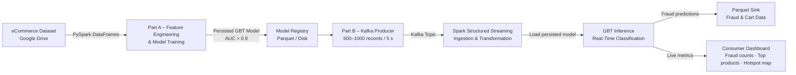

# Real-Time Fraud Detection & eCommerce Analytics

<p style="font-family: 'Montserrat', sans-serif; text-align: justify;">
End-to-end big data pipeline combining PySpark ML, Apache Kafka, and Spark Structured Streaming to detect fraudulent eCommerce transactions in real time — from model training to live dashboard.
</p>

<div align="center">


</div>

> 📎 **Deliverables** &nbsp;|&nbsp; [📓 Part A – Model Notebook](https://github.com/huypa/Portfolio/blob/main/big-data-processing/A2A_aphu0004.ipynb) &nbsp;|&nbsp; [📓 Part B – Kafka Producer](https://github.com/huypa/Portfolio/blob/main/big-data-processing/Assignment-2B-Task1_producer_34140298.ipynb) &nbsp;|&nbsp; [📓 Part B – Spark Streaming](https://github.com/huypa/Portfolio/blob/main/big-data-processing/Assignment-2B-Task2_spark_streaming_34140298.ipynb) &nbsp;|&nbsp; [📓 Part B – Consumer Dashboard](https://github.com/huypa/Portfolio/blob/main/big-data-processing/Assignment-2B-Task3_consumer_34140298.ipynb) &nbsp;|&nbsp; [🗂️ Dataset (Google Drive)](https://drive.google.com/drive/u/1/folders/1YpGqiuJll28ZlYhHasONw-o4b4QAI_s9)

---

## 1. Quick Introduction

<p style="font-family: 'Montserrat', sans-serif; text-align: justify;">
Developed as part of <em><strong>FIT5202 – Data Processing for Big Data</strong></em> at Monash University, this project tackles real-world <strong>eCommerce fraud detection</strong> at scale by building an end-to-end data pipeline across two phases: batch ML model training and real-time streaming inference. I designed and implemented the full pipeline — from <strong>feature engineering</strong> on large PySpark DataFrames, through model selection (<strong>Gradient Boosted Trees</strong>, <strong>AUC > 0.9</strong>), to deploying the persisted model inside a live <strong>Kafka–Spark Structured Streaming</strong> system that classifies <strong>500–1000 transactions every 5 seconds</strong>. The most significant outcome was delivering a working, low-latency fraud detection prototype with real-time dashboards covering <strong>fraud hotspot maps</strong>, product monitoring, and transaction volumes.
</p>

---

## 2. Problem Statement

<p style="font-family: 'Montserrat', sans-serif; text-align: justify;">
<strong>eCommerce fraud</strong> costs businesses billions annually and erodes customer trust. Traditional <strong>batch-based fraud screening</strong> is too slow — fraudulent transactions are often completed before analysts can act. The business challenge here is two-fold: first, building a machine learning model accurate enough to reliably flag fraud in noisy, <strong>imbalanced transaction data</strong>; second, operationalising that model so it scores incoming transactions in near real time, enabling immediate intervention. Without a scalable <strong>streaming architecture</strong>, even the best offline model delivers no practical value at the <strong>point of sale</strong>.
</p>

---

## 3. Architecture / Data Flow



---

## 4. Tech Stack

<div align="center">

| Tool | Role | Why Chosen |
|------|------|------------|
| **PySpark (DataFrames + MLlib)** | Distributed data processing & ML training | Handles large-scale data; native ML pipelines with cross-validation |
| **Gradient Boosted Trees (GBT)** | Primary fraud classification model | Outperformed Random Forest with AUC > 0.9 on imbalanced fraud data |
| **Random Forest** | Baseline ML model | Strong ensemble baseline; interpretable feature importances |
| **K-Means Clustering** | Fraudster behaviour profiling | Unsupervised segmentation of fraud patterns without labelled clusters |
| **Apache Kafka** | Real-time message streaming | Industry-standard distributed log; decouples producer and consumer at scale |
| **Spark Structured Streaming** | Stream ingestion & ML inference | Unified API with batch Spark; micro-batch processing with low latency |
| **Parquet** | Persistent storage for predictions | Columnar format optimised for downstream analytics queries |
| **Matplotlib / Pandas** | Dashboards & visualisations | Rapid plotting for real-time fraud metrics and hotspot maps |

</div>

---

## 5. Key Features

- **High-accuracy fraud classifier** — Gradient Boosted Trees achieved AUC > 0.9 after systematic hyperparameter tuning via cross-validation on engineered behavioural and demographic features.
- **Live streaming inference at scale** — Kafka producer simulates 500–1000 transaction records every 5 seconds; Spark Structured Streaming applies the persisted GBT model to each micro-batch with no retraining required.
- **Fraudster behaviour segmentation** — K-Means clustering identifies distinct fraud profiles (e.g., high-value rapid purchasers vs. account-takeover patterns), enabling targeted intervention strategies.
- **Real-time operational dashboards** — Consumer notebooks surface live fraud counts, top-selling products in flagged transactions, and geographic hotspot maps, giving analysts actionable visibility.
- **Data ethics & privacy compliance** — Part A explicitly addresses anonymisation, consent, and responsible handling of sensitive demographic and transactional data in line with Australian Privacy Principles.

---

## 6. Getting Started

### Prerequisites

- Python 3.8+
- Java 8 or 11 (required for Spark)
- Apache Spark 3.x
- Apache Kafka 3.x
- Jupyter Notebook or JupyterLab

### Dataset

<p style="font-family: 'Montserrat', sans-serif; text-align: justify;">
The dataset is large and stored externally. Download it from the public Google Drive folder and place it in a <code>data/</code> directory at the project root before running any notebooks.
</p>

[Download Dataset from Google Drive](https://drive.google.com/drive/u/1/folders/1YpGqiuJll28ZlYhHasONw-o4b4QAI_s9)

### Install Dependencies

```bash
pip install pyspark kafka-python pandas matplotlib jupyter
```

### Running Part A – Model Training

```bash
jupyter notebook A2A_aphu0004.ipynb
```

<p style="font-family: 'Montserrat', sans-serif; text-align: justify;">
Run all cells sequentially. The notebook will load the dataset, perform <strong>feature engineering</strong>, train <strong>Random Forest</strong> and <strong>GBT model</strong>s, evaluate them, and persist the best <strong>GBT model</strong> to disk for use in Part B.
</p>

### Running Part B – Real-Time Streaming

<p style="font-family: 'Montserrat', sans-serif; text-align: justify;">
Start each notebook in a separate terminal/kernel in the following order:
</p>

**1. Start Kafka** (ensure Zookeeper and Kafka broker are running):

```bash
# Start Zookeeper
bin/zookeeper-server-start.sh config/zookeeper.properties

# Start Kafka broker
bin/kafka-server-start.sh config/server.properties
```

**2. Run the Kafka Producer:**

```bash
jupyter notebook Assignment-2B-Task1_producer_34140298.ipynb
```

**3. Run Spark Structured Streaming:**

```bash
jupyter notebook Assignment-2B-Task2_spark_streaming_34140298.ipynb
```

**4. Run the Consumer Dashboard:**

```bash
jupyter notebook Assignment-2B-Task3_consumer_34140298.ipynb
```

<p style="font-family: 'Montserrat', sans-serif; text-align: justify;">
The <strong>Spark Structured Streaming</strong> notebook loads the persisted <strong>GBT model</strong> and applies it to each incoming micro-batch, writing fraud predictions to Parquet for downstream consumption.
</p>

---

## 7. Results / Impact

<div align="center">

| Metric | Value |
|--------|-------|
| **Best Model** | Gradient Boosted Trees (GBT) |
| **AUC Score** | > 0.9 |
| **Streaming Throughput** | 500–1000 transactions / 5 seconds |
| **Fraud Segmentation** | K-Means clusters identified distinct fraudster profiles |
| **Pipeline Latency** | Near real-time (micro-batch Spark Structured Streaming) |
| **Storage Format** | Parquet — fraud predictions + shopping cart data persisted |
| **Dashboard Coverage** | Fraud counts · Top products · Geographic hotspot maps |

</div>

---

## 8. Lessons Learned

<p style="font-family: 'Montserrat', sans-serif; text-align: justify;">
<strong>1. Model persistence is the critical bridge between batch and streaming.</strong> Serialising the trained GBT model and loading it inside the Spark Structured Streaming context — without retraining — required careful attention to <strong>Spark version compatibility</strong> and <strong>schema alignment</strong> between training and inference DataFrames. Any mismatch silently degrades predictions rather than throwing an obvious error.
</p>

<p style="font-family: 'Montserrat', sans-serif; text-align: justify;">
<strong>2. Kafka throughput tuning is non-trivial at scale.</strong> Simulating 500–1000 records every 5 seconds exposed bottlenecks in <strong>producer batch size</strong>, <strong>Kafka topic partition count</strong>, and <strong>micro-batch trigger intervals</strong>. Aligning these three levers was essential to prevent consumer lag from accumulating during sustained load.
</p>

<p style="font-family: 'Montserrat', sans-serif; text-align: justify;">
<strong>3. Data ethics cannot be an afterthought in fraud systems.</strong> Working with demographic and behavioural data highlighted how easily a fraud model can encode <strong>proxy discrimination</strong> (e.g., flagging based on geography or device type that correlates with protected attributes). Explicitly reviewing fairness, <strong>anonymisation</strong>, and data minimisation as part of Part A built habits that should be standard practice in any production ML system aligned with <strong>Australian Privacy Principles</strong>.
</p>

---

## 9. Author

<div align="center" style="font-family: 'Montserrat', sans-serif;">

**Anh Huy Phung**
Analytics Engineer & Data Scientist

🌐 [Portfolio](https://huyphungportfolio.vercel.app/#) · 🐙 [GitHub](https://github.com/huypa) · 💼 [LinkedIn](https://www.linkedin.com/in/anh-huy-phung-a16503212/?skipRedirect=true) · 📧 [Huyphung.work@gmail.com](mailto:Huyphung.work@gmail.com)

</div>
