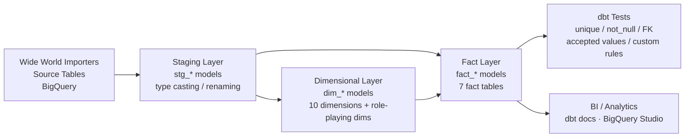

# Data Warehouse — BigQuery + dbt (Kimball Dimensional Modeling)

<p style="font-family: 'Montserrat', sans-serif; text-align: justify;">
An end-to-end data warehouse built on <strong>Google BigQuery</strong> and <strong>dbt</strong>, applying Kimball dimensional modeling to the Wide World Importers dataset — covering sales, purchasing, supplier transactions, and salesperson performance across a modular, fully-tested dbt pipeline.
</p>

<div align="center">


</div>

> 📎 **Deliverables** &nbsp;|&nbsp; [📄 Report](https://github.com/huypa/Portfolio/blob/main/data-warehouse/) &nbsp;|&nbsp; [🗂️ Models](https://github.com/huypa/Portfolio/blob/main/data-warehouse/models/analytics/)

---

## 1. Quick Introduction

<p style="font-family: 'Montserrat', sans-serif; text-align: justify;">
This project demonstrates a <strong>production-grade data warehouse</strong> workflow for a fictional international wholesale trading company — <strong>Wide World Importers</strong> — using BigQuery as the <strong>cloud warehouse</strong> and dbt as the <strong>transformation layer</strong>. I designed a <strong>Kimball-style star schema</strong> with <strong>10 dimension tables</strong> and <strong>7 fact tables</strong>, organized into a fully modular dbt DAG spanning <strong>staging, dimensional, and analytical layers</strong>. The most impressive outcome is a pipeline that enforces data quality through <strong>automated dbt tests</strong> (unique, not_null, FK relationships, accepted values, and custom business rules) with <strong>full documentation coverage</strong> generated via <code>dbt docs</code>.
</p>

---

## 2. Problem Statement

<p style="font-family: 'Montserrat', sans-serif; text-align: justify;">
Raw transactional data from an <strong>OLTP system</strong> is rarely query-ready for analytics. Tables are <strong>normalized</strong>, joins are deep, and business logic is buried in application code. Without a structured warehouse layer, analysts write <strong>slow, redundant, error-prone SQL</strong> — and no one agrees on what "revenue" or "active customer" means. This project solves that by centralizing <strong>business definitions</strong> in dbt models, enforcing <strong>data contracts</strong> through tests, and exposing clean, <strong>conformed dimensions and facts</strong> that any BI tool can consume directly. The result is a <strong>single source of truth</strong> for <strong>sales, purchasing, supplier, and salesperson performance</strong> across the entire organization.
</p>

---

## 3. Architecture / Data Flow

<p style="font-family: 'Montserrat', sans-serif; text-align: justify;">
The pipeline follows a <strong>three-layer dbt architecture</strong>: raw source data lands in BigQuery, <strong>staging models</strong> clean and rename fields, <strong>dimensional models</strong> apply <strong>Kimball SCD logic</strong> and <strong>surrogate keys</strong>, and <strong>fact models</strong> join dimensions to produce <strong>conformed grain-level metrics</strong>.
</p>



---

## 4. Tech Stack

<div align="center">

| Tool | Role | Why Chosen |
|:---|:---|:---|
| **Google BigQuery** | Cloud data warehouse | Serverless, scalable, native dbt adapter |
| **dbt Core** | Transformation & orchestration | SQL-first, modular, built-in testing & docs |
| **Python** | Environment & dependencies | dbt installation via `requirements.txt` |
| **Kimball Dimensional Modeling** | Schema design methodology | Industry-standard star schema for BI workloads |
| **YAML** | Test & schema definitions | Declarative data contracts for every model |
| **Wide World Importers** | Source dataset | Rich, realistic OLTP dataset from Microsoft |

</div>

---

## 5. Key Features

- **Modular 3-layer DAG** — staging → dimensional → facts with clean dependency graph; every model is independently testable and re-runnable
- **10 conformed dimensions** including a monthly customer snapshot (`fact_customer_snapshot_monthly`) and role-playing dimensions under `models/analytics/role_playing_dimensions/`
- **7 fact tables** spanning sales orders, purchase orders, supplier transactions, and salesperson targets — each at its natural business grain
- **Automated dbt test suite** covering primary key uniqueness, not-null constraints, referential integrity (FK), accepted value sets, and custom business rule assertions
- **Full documentation coverage** — every model and column documented and served via `dbt docs generate && dbt docs serve`

---

## 6. Getting Started

<p style="font-family: 'Montserrat', sans-serif; text-align: justify;">
Clone the repository and follow the steps below. You will need a <strong>Google Cloud project</strong> with <strong>BigQuery</strong> enabled and a <strong>service account key</strong>.
</p>

```bash
# 1. Install Python dependencies
pip install -r bin/requirements.txt

# 2. Copy the connection profile template
cp profiles.bigquery-template.yml ~/.dbt/profiles.yml

# 3. Edit ~/.dbt/profiles.yml and fill in your BigQuery project, dataset,
#    and service account credentials

# 4. Install dbt packages
dbt deps

# 5. Run all models
dbt run

# 6. Execute the full test suite
dbt test

# 7. Generate and serve documentation (lineage DAG + column descriptions)
dbt docs generate && dbt docs serve
```

<p style="font-family: 'Montserrat', sans-serif; text-align: justify;">
After <code>dbt docs serve</code>, open <code>http://localhost:8080</code> to explore the <strong>lineage DAG</strong>, model descriptions, and <strong>column-level documentation</strong>.
</p>

---

## 7. Results / Impact

<div align="center">

| Metric | Value |
|:---|:---:|
| Dimension tables delivered | 10 |
| Fact tables delivered | 7 |
| dbt models in pipeline | 17+ |
| dbt test assertions | 6 YAML test files |
| Test types covered | unique, not_null, FK, accepted_values, custom |
| Documentation coverage | 100% of analytical models |
| Pipeline layers | 3 (staging → dimensional → facts) |
| Source dataset tables modeled | Wide World Importers (full transactional scope) |

</div>

---

## 8. Lessons Learned

<p style="font-family: 'Montserrat', sans-serif; text-align: justify;">
<strong>1. Grain definition is the hardest part of dimensional modeling.</strong> Choosing the <strong>wrong grain</strong> for a fact table — e.g., mixing order-level and line-level measures — causes silent <strong>aggregation errors</strong> downstream. Separating <strong><code>fact_sales_order</code></strong> (<strong>header grain</strong>) from <strong><code>fact_sales_order_line</code></strong> (<strong>line grain</strong>) was a deliberate design decision that paid off in BI query accuracy.
</p>

<p style="font-family: 'Montserrat', sans-serif; text-align: justify;">
<strong>2. dbt tests are a contract, not an afterthought.</strong> Running tests late in the project surface <strong>FK mismatches</strong> that traced back to upstream <strong>staging logic</strong>. Embedding tests from the first model onwards — and failing the pipeline on test errors — would have caught these issues earlier and saved significant rework.
</p>

<p style="font-family: 'Montserrat', sans-serif; text-align: justify;">
<strong>3. Role-playing dimensions require explicit naming conventions.</strong> Reusing a single <strong><code>dim_date</code></strong> for order date, ship date, and delivery date demands aliased references in fact CTEs. Establishing a clear naming convention (<strong><code>order_date_key</code></strong>, <strong><code>ship_date_key</code></strong>) across all fact tables from the start prevents ambiguity in SQL and in the generated documentation.
</p>

---

## 9. Author

<div align="center" style="font-family: 'Montserrat', sans-serif;">

**Anh Huy Phung** — Analytics Engineer & Data Scientist

🌐 [Portfolio](https://huyphungportfolio.vercel.app/#) · 🐙 [GitHub](https://github.com/huypa) · 💼 [LinkedIn](https://www.linkedin.com/in/anh-huy-phung-a16503212/?skipRedirect=true) · 📧 [Huyphung.work@gmail.com](mailto:Huyphung.work@gmail.com)

</div>
