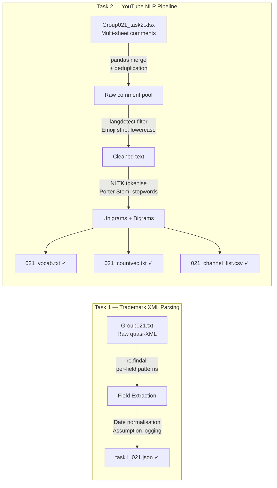

# Text Data Wrangling & NLP Pre-processing

<div align="center">


</div>

> 📎 **Deliverables** &nbsp;|&nbsp; [📄 Task 1 Report (PDF)](https://github.com/huypa/Portfolio-Data-Wrangling/blob/main/021_ass1/task1_021.pdf) &nbsp;|&nbsp; [📄 Task 2 Report (PDF)](https://github.com/huypa/Portfolio-Data-Wrangling/blob/main/021_ass1/task2_021.pdf) &nbsp;|&nbsp; [📓 Task 1 Notebook](https://github.com/huypa/Portfolio-Data-Wrangling/blob/main/021_ass1/task1_021.ipynb) &nbsp;|&nbsp; [📓 Task 2 Notebook](https://github.com/huypa/Portfolio-Data-Wrangling/blob/main/021_ass1/task2_021.ipynb)

---

## 1. Quick Introduction

<p style="font-family: 'Montserrat', sans-serif; text-align: justify;">
This project builds two independent wrangling pipelines for a university assignment scored <strong>99/100</strong>. In Task 1, I parsed a government-formatted <strong>quasi-XML trademark file</strong> into a <strong>structured JSON dataset</strong> using only <strong>Python regex</strong> — no <strong>XML library</strong> could handle the malformed structure. In Task 2, I transformed multi-channel <strong>YouTube comment exports</strong> into <strong>NLP-ready count vectors</strong>, including <strong>language filtering</strong>, <strong>stemming</strong>, and <strong>vocabulary construction</strong>, producing outputs ready for downstream <strong>ML classification</strong>.
</p>

---

## 2. Problem Statement

- **Pain point**: Raw data from external sources rarely arrives in a usable format — both inputs here are structurally broken or mixed-encoding dumps.
- **Trademark XML**: a `.txt` quasi-XML file with **inconsistent delimiters** and **nested legal entity blocks** that standard parsers cannot handle.
- **YouTube comments**: multi-sheet Excel exports in **mixed languages and encodings** that must be deduplicated and vectorised before any ML use.
- **Why it matters**: every silent assumption about **missing data** or input schema compounds into unreliable downstream analytics.

---

## 3. Architecture / Data Flow



---

## 4. Tech Stack

<div align="center">

| Tool | Role | Why chosen |
|:---|:---|:---|
| Python `re` | Field-level extraction from quasi-XML | No XML library handles malformed quasi-XML; regex gives precise per-field control |
| `pandas` | Merge, deduplication, CSV export | Standard for tabular transformation with low overhead |
| `json` | Schema-enforced output serialisation | Lightweight, human-readable, directly ingestible by downstream tools |
| `langdetect` | Language identification | Prevents non-English noise from entering the NLP vocabulary |
| NLTK (Porter Stemmer) | Tokenisation, stemming, stopword removal | Mature, reproducible NLP toolkit with well-documented stemming behaviour |
| Google Colab | Collaborative notebook environment | Zero-setup sharing; both contributors work on the same runtime |

</div>

---

## 5. Key Features

- **Regex-only XML parser** — handles reel/frame numbers, multi-line assignor/assignee blocks, and ambiguous legal entity descriptions that break standard parsers
- **Documented null strategy** — every missing-value assumption is written inline in the notebook, never silently dropped
- **Language gate before NLP** — `langdetect` filters non-English comments before any stemming occurs, keeping the vocabulary clean
- **Controlled pipeline order** — unigram/bigram construction follows a fixed sequence (tokenise → stopword filter → stem) so vectors are reproducible across runs
- **Full artefact persistence** — all intermediate and final outputs (`.json`, `.txt`, `.csv`) are saved separately, enabling downstream use without re-running the pipeline

---

## 6. Getting Started

```bash
git clone https://github.com/huypa/Portfolio-Data-Wrangling.git
cd Portfolio-Data-Wrangling/021_ass1
```

```bash
pip install pandas nltk langdetect
```

```bash
# Task 1 — XML to JSON
jupyter notebook task1_021.ipynb

# Task 2 — YouTube comment NLP
jupyter notebook task2_021.ipynb
```

---

## 7. Results / Impact

<div align="center">

| Metric | Value |
|:---|:---|
| Assignment score | **99 / 100** |
| Trademark records parsed | Full JSON output with all required fields from raw quasi-XML |
| YouTube channels processed | Multiple channels → per-channel sparse count vectors |
| Vocabulary artefacts | `021_vocab.txt` (unigrams + bigrams) + `021_countvec.txt` (sparse matrix) |
| Channel stats | `021_channel_list.csv` ready for EDA or ML ingestion |

</div>

**Task 1 — Parsed trademark records (JSON output):**

<div align="center">


</div>

**Task 2 — NLP pipeline output (count vectors per channel):**

<div align="center">


</div>

**Assignment score:**

<div align="center">


</div>

---

## 8. Lessons Learned

- **Regex over libraries when schema is broken**: targeted per-field patterns are faster to debug and more reliable than forcing a standard parser on non-conformant files.
- **Pipeline step order changes results**: applying stemming before vs. after stopword removal produces different vocabularies — documenting the **step sequence** is as critical as the code.
- **Null handling is a design decision**: every assumption made to fill or drop a missing value shapes downstream analytics; **inline documentation** prevents silent error compounding.

---

## 9. Author

<div align="center">

<p style="font-family: 'Montserrat', sans-serif;">
Written by <strong>Anh Huy Phung</strong> — Analytics Engineer & Data Scientist
</p>

🌐 [Portfolio](https://huyphungportfolio.vercel.app/#) &nbsp;·&nbsp; 🐙 [GitHub](https://github.com/huypa) &nbsp;·&nbsp; 💼 [LinkedIn](https://www.linkedin.com/in/anh-huy-phung-a16503212/?skipRedirect=true) &nbsp;·&nbsp; 📧 [Huyphung.work@gmail.com](mailto:Huyphung.work@gmail.com)

</div>
