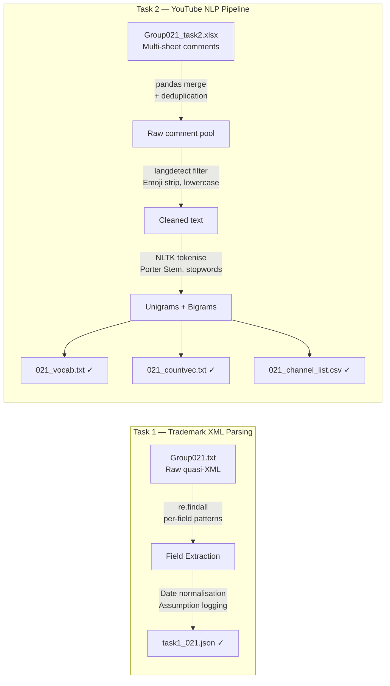

# Text Data Wrangling & NLP Pre-processing


> 📎 **Deliverables** &nbsp;|&nbsp; [📄 Task 1 Report (PDF)](https://github.com/huypa/Portfolio-Data-Wrangling/blob/main/021_ass1/task1_021.pdf) &nbsp;|&nbsp; [📄 Task 2 Report (PDF)](https://github.com/huypa/Portfolio-Data-Wrangling/blob/main/021_ass1/task2_021.pdf) &nbsp;|&nbsp; [📓 Task 1 Notebook](https://github.com/huypa/Portfolio-Data-Wrangling/blob/main/021_ass1/task1_021.ipynb) &nbsp;|&nbsp; [📓 Task 2 Notebook](https://github.com/huypa/Portfolio-Data-Wrangling/blob/main/021_ass1/task2_021.ipynb)

---

## 1. Quick Introduction

This project builds two independent wrangling pipelines for a university assignment scored **99/100**. In Task 1, I parsed a government-formatted quasi-XML trademark file into a structured JSON dataset using only Python regex — no XML library could handle the malformed structure. In Task 2, I transformed multi-channel YouTube comment exports into NLP-ready count vectors, including language filtering, stemming, and vocabulary construction, producing outputs ready for downstream ML classification.

---

## 2. Problem Statement

Raw data from external sources rarely arrives in a usable format. This project addresses two concrete scenarios:

- **Trademark XML records**: a `.txt` file containing quasi-XML with inconsistent delimiters, nested legal entity blocks, and missing values — standard parsers fail on this format, yet the data must become a clean, query-ready JSON dataset.
- **YouTube comment exports**: multi-sheet Excel dumps in mixed languages and encodings that must be deduplicated, cleaned, and converted into sparse numerical feature matrices for ML.

Both tasks mirror what a data engineer encounters in practice: unstructured inputs with no schema guarantees, where every assumption about missing data carries downstream consequences.

---

## 3. Architecture / Data Flow



---

## 4. Tech Stack

| Tool | Role | Why chosen |
|---|---|---|
| Python `re` | Field-level extraction from quasi-XML | No XML library handles malformed quasi-XML; regex gives precise per-field control |
| `pandas` | Merge, deduplication, CSV export | Standard for tabular transformation with low overhead |
| `json` | Schema-enforced output serialisation | Lightweight, human-readable, directly ingestible by downstream tools |
| `langdetect` | Language identification | Prevents non-English noise from entering the NLP vocabulary |
| NLTK (Porter Stemmer) | Tokenisation, stemming, stopword removal | Mature, reproducible NLP toolkit with well-documented stemming behaviour |
| Google Colab | Collaborative notebook environment | Zero-setup sharing; both contributors work on the same runtime |

---

## 5. Key Features

- **Regex-only XML parser** — handles reel/frame numbers, multi-line assignor/assignee blocks, and ambiguous legal entity descriptions that break standard parsers
- **Documented null strategy** — every missing-value assumption is written inline in the notebook, never silently dropped
- **Language gate before NLP** — `langdetect` filters non-English comments before any stemming occurs, keeping the vocabulary clean
- **Controlled pipeline order** — unigram/bigram construction follows a fixed sequence (tokenise → stopword filter → stem) so vectors are reproducible across runs
- **Full artefact persistence** — all intermediate and final outputs (`.json`, `.txt`, `.csv`) are saved separately, enabling downstream use without re-running the pipeline

---

## 6. Getting Started

```bash
git clone https://github.com/huypa/Portfolio-Data-Wrangling.git
cd Portfolio-Data-Wrangling/021_ass1
```

```bash
pip install pandas nltk langdetect
```

Open notebooks in order:

```bash
# Task 1 — XML to JSON
jupyter notebook task1_021.ipynb

# Task 2 — YouTube comment NLP
jupyter notebook task2_021.ipynb
```

---

## 7. Results / Impact

| Metric | Value |
|---|---|
| Assignment score | **99 / 100** |
| Trademark records parsed | Full JSON output with all required fields from raw quasi-XML |
| YouTube channels processed | Multiple channels → per-channel sparse count vectors |
| Vocabulary artefacts | `021_vocab.txt` (unigrams + bigrams) + `021_countvec.txt` (sparse matrix) |
| Channel stats | `021_channel_list.csv` ready for EDA or ML ingestion |

---

## 8. Lessons Learned

1. **Regex over libraries when schema is broken** — standard XML parsers reject non-conformant files; writing targeted per-field patterns was faster to debug and more reliable than forcing a library.
2. **Pipeline step order changes results** — applying stemming before vs. after stopword removal produces different vocabularies; documenting the order is as critical as the code itself.
3. **Null handling is a design decision** — every assumption made to fill or drop a missing value shapes downstream analytics; inline documentation prevents silent error compounding.

---

## 9. Author

**Anh Huy Phung** — Analytics Engineer & Data Scientist

🌐 [Portfolio](https://huyphungportfolio.vercel.app/) · 🐙 [GitHub](https://github.com/huypa) · 💼 [LinkedIn](https://linkedin.com/in/phung-anh-huy)
