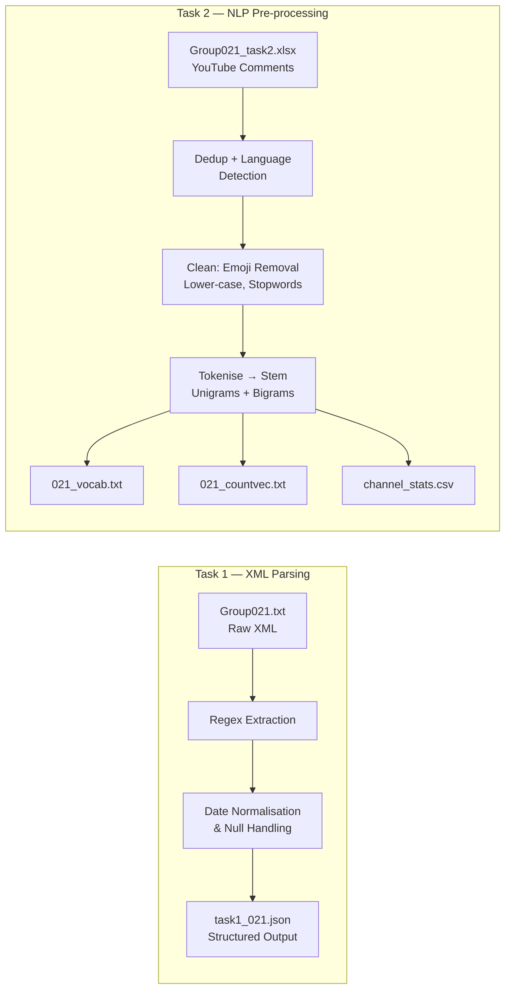

# Text Data Wrangling & Pre-processing


End-to-end pipeline for parsing semi-structured XML records and building NLP-ready feature matrices from raw YouTube comment data.

---

## Problem Statement

Raw data rarely arrives clean. This project tackles two real-world wrangling challenges:

1. **Trademark XML records** — a government-formatted text file with inconsistent delimiters, nested fields, and missing values that must become a query-ready JSON dataset.
2. **YouTube comments** — multi-sheet Excel dumps in mixed languages and encodings that must become numerical vectors for downstream ML classification.

Both tasks mirror what a data engineer encounters daily: turning messy inputs into structured outputs with no tolerance for silent data loss.

---

## Architecture / Data Flow



---

## Tech Stack

| Tool | Role | Why chosen |
|---|---|---|
| Python `re` | Regex-based XML field extraction | No XML lib can handle malformed quasi-XML; regex gives precise control |
| `pandas` | DataFrame operations, deduplication, CSV export | Standard for tabular transformation |
| `json` | JSON serialisation with schema enforcement | Lightweight, human-readable output for Task 1 |
| `langdetect` | Language identification on comment text | Needed to filter non-English comments before NLP |
| `NLTK` | Tokenisation, Porter Stemmer, stopword list | Mature NLP toolkit with reproducible stemming |
| Google Colab | Collaborative notebook environment | Zero-setup sharing for group assignment |

---

## Key Features

- **Regex-only XML parser**: no external XML library — handles reel/frame numbers, multi-line assignor/assignee blocks, and ambiguous legal entity descriptions
- **Assumption-documented null handling**: every missing-value decision is explicitly recorded and justified, not silently dropped
- **Language-aware cleaning**: emoji stripping + `langdetect` filter before tokenisation, preventing noise from non-English comments
- **Controlled vocabulary order**: unigrams and bigrams built with deliberate ordering to ensure reproducible sparse vectors
- **Full audit trail**: intermediate CSVs, vocabulary lists, and count vectors all persisted alongside source notebooks

---

## Results / Impact

| Metric | Value |
|---|---|
| Assignment score | **99 / 100** |
| Trademark records parsed (Task 1) | structured JSON from raw XML with full field coverage |
| YouTube channels processed (Task 2) | multiple channels → per-channel count vectors |
| Vocabulary artefacts produced | `021_vocab.txt` + `021_countvec.txt` ready for ML ingestion |

---

## Getting Started

```bash
# Clone and open notebooks
git clone https://github.com/huypa/Portfolio-Data-Wrangling.git
cd Portfolio-Data-Wrangling/021_ass1

# Task 1 — XML to JSON
jupyter notebook task1_021.ipynb

# Task 2 — YouTube comment NLP
jupyter notebook task2_021.ipynb
```

**Dependencies** (install in Colab or local env):

```bash
pip install pandas nltk langdetect
```

---

## Lessons Learned

1. **Regex over libraries when schema is broken** — standard XML parsers reject non-conformant files; writing targeted regex patterns for each field was more reliable and faster to debug.
2. **Order matters in NLP pipelines** — applying stemming before stopword removal produces different vocabularies than the reverse; documenting this order is as important as the code itself.
3. **Null handling is a design decision** — every assumption made to fill or drop a missing value changes downstream analytics; explicit documentation prevents silent errors from compounding.

---

## Author

**Anh Huy Phung** — Analytics Engineer & Data Scientist
[GitHub](https://github.com/huypa) · [LinkedIn](https://linkedin.com/in/phung-anh-huy)

> Task reports: [Task 1 PDF](https://github.com/huypa/Portfolio-Data-Wrangling/blob/main/021_ass1/task1_021.pdf) · [Task 2 PDF](https://github.com/huypa/Portfolio-Data-Wrangling/blob/main/021_ass1/task2_021.pdf)
