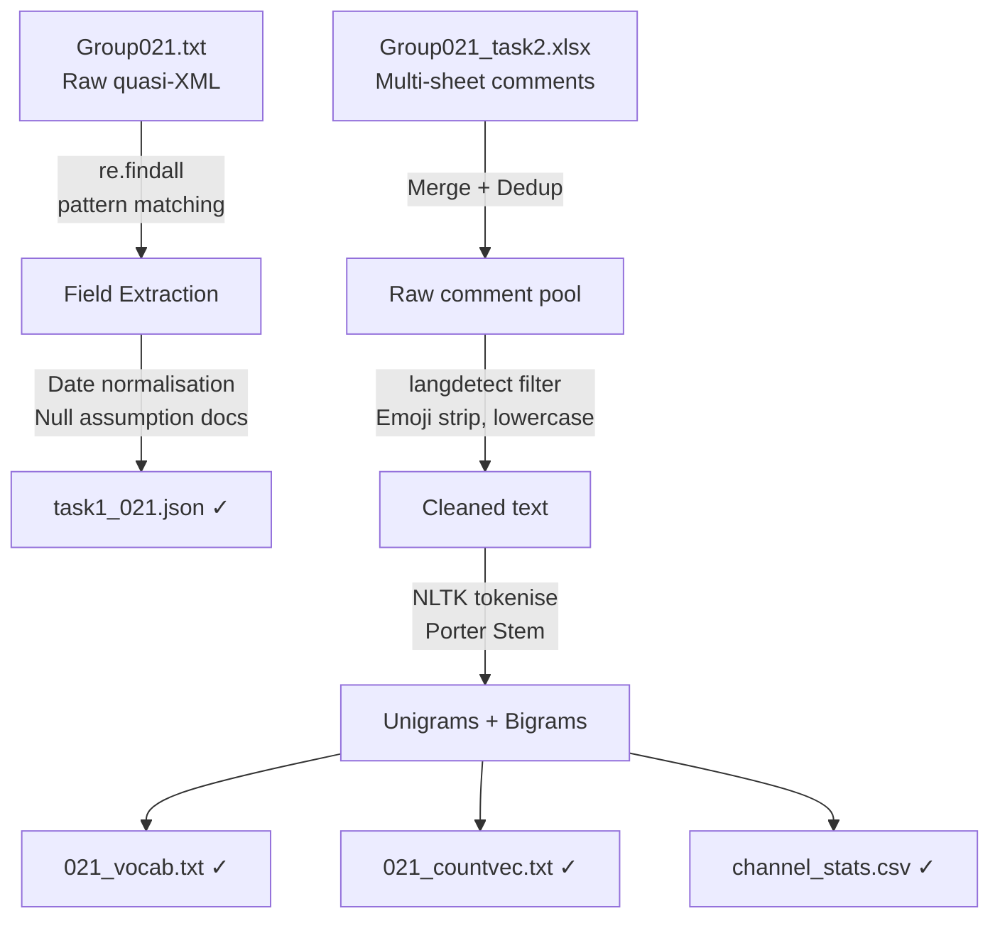

# Text Data Wrangling & NLP Pre-processing


Two-task pipeline: parse government trademark XML records into structured JSON, then transform multi-language YouTube comments into ML-ready count vectors — scored **99/100**.

---

## Problem Statement

Unstructured and semi-structured data is the norm, not the exception. This project addresses two distinct real-world scenarios:

- A quasi-XML trademark file with inconsistent delimiters and nested legal fields that no standard parser can handle
- Multi-channel YouTube comment dumps in mixed encodings and languages that need to become numerical feature matrices

The goal: zero data loss, every assumption documented, outputs immediately usable downstream.

---

## Data Flow



---

## Tech Stack

| Tool | Role |
|---|---|
| Python `re` | Field-level regex extraction from malformed XML |
| `pandas` | Deduplication, merge, CSV export |
| `json` | Schema-enforced JSON serialisation |
| `langdetect` | Detect and filter non-English comments |
| NLTK (Porter Stemmer) | Tokenisation, stemming, stopword removal |
| Google Colab | Shared notebook environment |

---

## Key Features

- **Hand-rolled XML parser** using `re` — handles reel/frame numbers, multi-line assignor/assignee blocks, and ambiguous legal entities that break standard parsers
- **Documented null strategy** — every missing-value assumption is written in the notebook, not silently dropped
- **Language gate** before NLP — `langdetect` filters non-English comments before any stemming occurs
- **Reproducible vocabulary** — unigram/bigram order is fixed and documented so vectors are stable across runs
- **Persisted artefacts** — vocab list, count vectors, and per-channel stats are all saved as separate files for downstream use

---

## Results

| Item | Output |
|---|---|
| Trademark records | Fully structured JSON from raw quasi-XML |
| YouTube channels | Per-channel count vectors + vocabulary list |
| Deliverables | `.json`, `.txt` vocab, `.txt` sparse vectors, `.csv` stats |
| Assignment score | **99 / 100** |

---

## Getting Started

```bash
git clone https://github.com/huypa/Portfolio-Data-Wrangling.git
cd Portfolio-Data-Wrangling/021_ass1
```

```bash
pip install pandas nltk langdetect
```

Open `task1_021.ipynb` for XML parsing, `task2_021.ipynb` for NLP pre-processing.

---

## Lessons Learned

- Standard XML parsers break on government quasi-XML — targeted regex per field is more maintainable than forcing a library
- Pipeline step order changes results: stemming before vs. after stopword removal produces different vocabularies; document the order, not just the steps
- Null handling is a business decision masquerading as a technical one — writing down the assumption prevents silent compounding errors downstream

---

## Author

**Anh Huy Phung** — Analytics Engineer & Data Scientist  
[GitHub](https://github.com/huypa) · [LinkedIn](https://linkedin.com/in/phung-anh-huy)

Task reports: [Task 1](https://github.com/huypa/Portfolio-Data-Wrangling/blob/main/021_ass1/task1_021.pdf) · [Task 2](https://github.com/huypa/Portfolio-Data-Wrangling/blob/main/021_ass1/task2_021.pdf)
