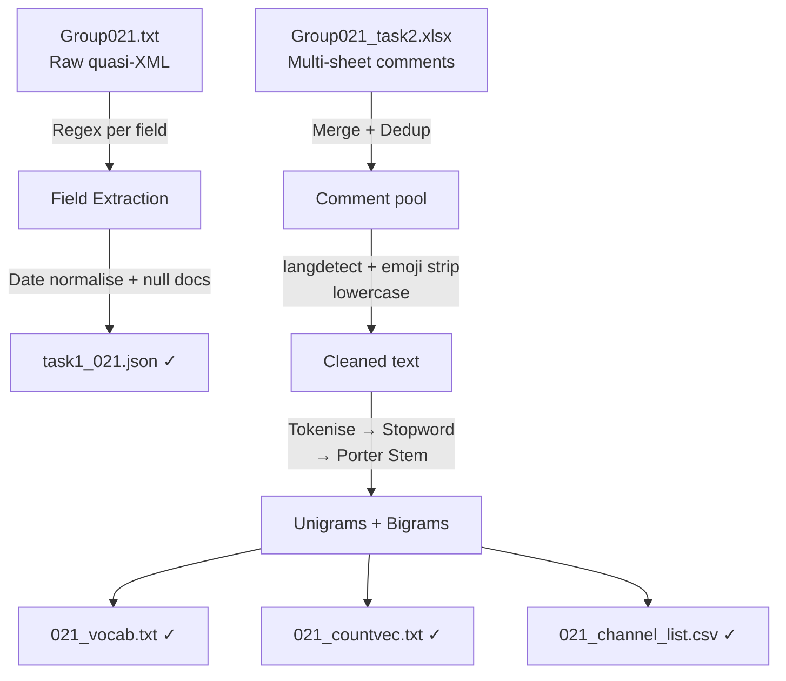

# Text Data Wrangling & NLP Pre-processing


> 📎 **Deliverables** &nbsp;|&nbsp; [📄 Task 1 Report](https://github.com/huypa/Portfolio-Data-Wrangling/blob/main/021_ass1/task1_021.pdf) &nbsp;|&nbsp; [📄 Task 2 Report](https://github.com/huypa/Portfolio-Data-Wrangling/blob/main/021_ass1/task2_021.pdf) &nbsp;|&nbsp; [📓 Notebooks](https://github.com/huypa/Portfolio-Data-Wrangling/tree/main/021_ass1)

---

## 1. Quick Introduction

Two-task pipeline built for a university assignment scored **99/100**. I parsed government trademark XML records into structured JSON using custom regex, then built a full NLP pre-processing pipeline that converts raw YouTube comments into ML-ready count vectors — covering language detection, emoji removal, stemming, and vocabulary construction.

---

## 2. Problem Statement

Standard parsers break on malformed quasi-XML. Manual NLP setup breaks on mixed-language text. This project solves both:

- **Task 1**: Extract structured trademark data from a non-conformant text file where no schema is guaranteed
- **Task 2**: Turn multi-channel YouTube comment exports into sparse feature matrices suitable for ML classification

---

## 3. Architecture / Data Flow



---

## 4. Tech Stack

| Tool | Role | Why chosen |
|---|---|---|
| Python `re` | XML field extraction | Only approach that works on malformed quasi-XML |
| `pandas` | Dedup, merge, CSV export | Standard tabular tool, zero overhead |
| `json` | Output serialisation | Human-readable, directly ingestible downstream |
| `langdetect` | Language filtering | Removes non-English noise before NLP |
| NLTK Porter Stemmer | Tokenise, stem, stopwords | Reproducible, well-documented stemming |
| Google Colab | Shared runtime | Zero setup for collaborative notebooks |

---

## 5. Key Features

- **Custom regex parser** — no XML library; handles nested legal entity blocks and reel/frame patterns that break parsers
- **Documented null decisions** — every missing-value assumption written inline, not silently dropped
- **Language gate** — `langdetect` runs before stemming to prevent non-English noise in vocabulary
- **Fixed pipeline order** — tokenise → stopword filter → stem sequence is locked and documented for reproducibility
- **Persisted artefacts** — all outputs (JSON, vocab, sparse vectors, CSV) saved separately for downstream reuse

---

## 6. Getting Started

```bash
git clone https://github.com/huypa/Portfolio-Data-Wrangling.git
cd Portfolio-Data-Wrangling/021_ass1
pip install pandas nltk langdetect
```

Open `task1_021.ipynb` for XML parsing, `task2_021.ipynb` for NLP pre-processing.

---

## 7. Results / Impact

```
Score: 99 / 100  |  Output: JSON + vocab + count vectors + channel CSV  |  Status: Production-ready artefacts
```

| Deliverable | Description |
|---|---|
| `task1_021.json` | Fully structured trademark records from raw quasi-XML |
| `021_vocab.txt` | Unigram + bigram vocabulary per channel |
| `021_countvec.txt` | Sparse count-vector matrix ready for ML |
| `021_channel_list.csv` | Per-channel comment statistics |

---

## 8. Lessons Learned

- Regex beats libraries when the schema is broken — targeted per-field patterns are more reliable than forcing a parser on non-conformant input
- Step order matters: stemming before vs. after stopword removal produces different vocabularies — document the order, not just the steps
- Null handling is a business decision — every fill or drop assumption compounds downstream; write it down

---

## 9. Author

**Anh Huy Phung** — Analytics Engineer & Data Scientist

[GitHub](https://github.com/huypa) · [LinkedIn](https://linkedin.com/in/phung-anh-huy)
