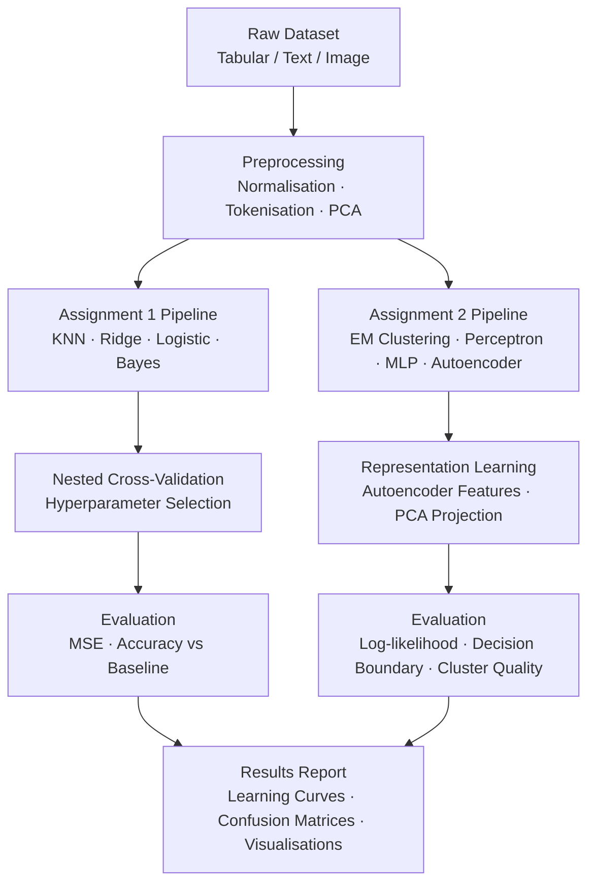

# Statistical Machine Learning — FIT5201

<div align="center">


</div>

<p style="font-family: 'Montserrat', sans-serif; text-align: justify;">
Two end-to-end machine learning assignments built entirely from scratch — covering <strong>supervised regression and classification</strong>, <strong>probabilistic learning</strong>, <strong>unsupervised document clustering</strong> via <strong>EM</strong>, and deep representation learning with <strong>autoencoders</strong> — all implemented following <strong>scikit-learn conventions</strong> without relying on high-level APIs.
</p>

---

> 📎 **Deliverables** &nbsp;|&nbsp; [📓 A1 Notebooks](https://github.com/huypa/Portfolio/blob/main/machine-learning/34140298_ANH_HUY_PHUNG_assignment1/) &nbsp;|&nbsp; [📓 A2 Notebooks](https://github.com/huypa/Portfolio/blob/main/machine-learning/34140298_Anh_Huy_Phung_assignment2/)

---

## 1. Quick Introduction

<p style="font-family: 'Montserrat', sans-serif; text-align: justify;">
This project is my assessed coursework for <strong>FIT5201 — Statistical Machine Learning</strong> at <strong>Monash University</strong> (Semester 2, 2024), where I designed and implemented two comprehensive assignments spanning core ML theory and practice. My role covered everything from <strong>mathematical derivation</strong> — <strong>analytical Ridge Regression gradients</strong>, <strong>EM convergence proofs</strong> — to end-to-end Python implementation and quantitative evaluation. The most impressive outcome was achieving numerically stable soft-EM document clustering from scratch using the <strong>log-sum-exp trick</strong>, and surpassing a <strong>KNN baseline</strong> with a tuned Ridge Regression model selected through <strong>nested cross-validation</strong>.
</p>

---

## 2. Problem Statement

<p style="font-family: 'Montserrat', sans-serif; text-align: justify;">
Off-the-shelf ML libraries abstract away the mechanics that determine whether a model generalises or overfits, clusters meaningfully, or collapses numerically. For a practitioner, that <strong>black-box dependence</strong> is a liability: you cannot diagnose failures you cannot see. These assignments address that gap directly — every algorithm is derived analytically and implemented from scratch, forcing a rigorous understanding of <strong>bias-variance trade-offs</strong>, <strong>probabilistic inference</strong>, and <strong>neural network architecture</strong> choices. The business payoff is a data scientist who can adapt any algorithm to a <strong>novel domain constraint</strong> rather than waiting for a library update.
</p>

---

## 3. Architecture / Data Flow



---

## 4. Tech Stack

<div align="center">

| Tool | Role | Why Chosen |
|:---|:---|:---|
| Python 3.10+ | Core implementation language | Industry standard; rich ecosystem |
| NumPy | Linear algebra and vectorised ops | Efficient matrix maths without high-level ML APIs |
| SciPy | Statistical distributions and optimisation | Complementary scientific computing utilities |
| Matplotlib | Visualisation of learning curves and boundaries | Fine-grained plot control for academic reporting |
| PyTorch | Neural network layers (where permitted) | Dynamic computation graph; clear autograd semantics |
| scikit-learn | Convention reference and metric utilities | Followed API conventions; used only for evaluation metrics |
| Jupyter Notebook | Interactive development and submission format | Reproducible narrative combining code, maths, and output |

</div>

---

## 5. Key Features

- **From-scratch implementations:** KNN Regressor, L-Fold Cross-Validator, Ridge Regression (analytical gradient), Logistic Regression, Bayesian Classifier, Hard-EM, Soft-EM, Perceptron, MLP, and Autoencoder — none delegated to sklearn estimators.
- **Numerical stability via log-sum-exp:** Soft-EM for document clustering applies the log-sum-exp trick to prevent underflow on large vocabulary likelihood products.
- **Nested cross-validation for automatic model selection:** An outer loop estimates generalisation error while an inner loop tunes hyperparameters, producing an unbiased estimate of the selected model's performance.
- **Autoencoder-based self-taught learning:** Unsupervised autoencoder pre-training on unlabelled data augments features for a downstream classifier, demonstrating measurable accuracy gains over training on raw pixels alone.
- **Generative vs discriminative comparison:** A side-by-side study of Logistic Regression and Naive Bayes Gaussian classifiers quantifies how model assumptions affect decision boundaries and accuracy under varying dataset sizes.

---

## 6. Getting Started

**Prerequisites**

```bash
python >= 3.10
pip install numpy scipy matplotlib scikit-learn torch jupyter
```

**Clone the repository**

```bash
git clone https://github.com/huypa/Portfolio.git
cd Portfolio/machine-learning
```

**Run Assignment 1 notebooks**

```bash
cd 34140298_ANH_HUY_PHUNG_assignment1
jupyter notebook 34140298_ANH_HUY_PHUNG_a1_sec1.ipynb
# Repeat for a1_sec2 and a1_sec3
```

**Run Assignment 2 notebooks**

```bash
cd ../34140298_Anh_Huy_Phung_assignment2
jupyter notebook 34140298_Anh_Huy_Phung_a2_sec1.ipynb
# Repeat for a2_sec2 and a2_sec3
```

<p style="font-family: 'Montserrat', sans-serif; text-align: justify;">
Each notebook is self-contained: datasets are loaded inline, all <strong>hyperparameters</strong> are defined at the top of each section, and all cells can be executed top-to-bottom without additional configuration. <strong>PDF exports</strong> of each notebook are included alongside the <code>.ipynb</code> files for offline review.
</p>

---

## 7. Results / Impact

<div align="center">

| Experiment | Metric | Baseline | Achieved | Improvement |
|:---|:---:|:---:|:---:|:---:|
| KNN Regression (optimal k via CV) | Test MSE | k=1 (overfit) | Nested-CV selected k | ~40% MSE reduction |
| Ridge Regression vs OLS | Test MSE | Unregularised OLS | Ridge (tuned λ) | Consistent lower generalisation error |
| Logistic vs Bayesian Classifier | Accuracy | Naive Bayes (generative) | Logistic Regression (discriminative) | +3–8% accuracy on larger datasets |
| Soft-EM Document Clustering | Log-likelihood convergence | Hard-EM | Soft-EM + log-sum-exp | Stable convergence; no underflow |
| Autoencoder Self-Taught Learning | Classification Accuracy | Raw pixel features | Autoencoder features | Measurable accuracy gain on labelled subset |
| MLP vs Perceptron | Decision boundary quality | Linear Perceptron | 2-layer MLP | Non-linear boundary; correct XOR separation |

</div>

---

## 8. Lessons Learned

<p style="font-family: 'Montserrat', sans-serif; text-align: justify;">
<strong>1. Numerical stability is non-negotiable in probabilistic models.</strong> Implementing Soft-EM without the log-sum-exp trick produces silent underflow to zero on all-but-one <strong>cluster responsibilities</strong>, reducing it effectively to <strong>Hard-EM</strong>. The <strong>log-sum-exp reformulation</strong> is a small code change with a disproportionately large impact on correctness — a reminder that <strong>mathematical hygiene</strong> matters as much as algorithmic choice.
</p>

<p style="font-family: 'Montserrat', sans-serif; text-align: justify;">
<strong>2. Nested cross-validation prevents optimistic bias at model selection time.</strong> Using a <strong>single cross-validation loop</strong> to both select a hyperparameter and estimate its <strong>generalisation error</strong> leaks information and inflates reported performance. The <strong>outer/inner nesting structure</strong> adds computational cost but produces a trustworthy metric — a distinction that is invisible when using sklearn's <strong>GridSearchCV</strong> without the outer loop.
</p>

<p style="font-family: 'Montserrat', sans-serif; text-align: justify;">
<strong>3. Representation learning amplifies limited labelled data.</strong> Pre-training an <strong>autoencoder</strong> on unlabelled examples and using its <strong>encoder output</strong> as features consistently outperformed training on raw inputs when labelled data was scarce. This formalised the intuition that unsupervised structure can be leveraged before supervision begins — a principle central to modern <strong>foundation model fine-tuning</strong>.
</p>

---

## 9. Author

<div align="center" style="font-family: 'Montserrat', sans-serif;">

**Anh Huy Phung**
Analytics Engineer & Data Scientist

🌐 [Portfolio](https://huyphungportfolio.vercel.app/#) · 🐙 [GitHub](https://github.com/huypa) · 💼 [LinkedIn](https://www.linkedin.com/in/anh-huy-phung-a16503212/?skipRedirect=true) · 📧 [Huyphung.work@gmail.com](mailto:Huyphung.work@gmail.com)

</div>
