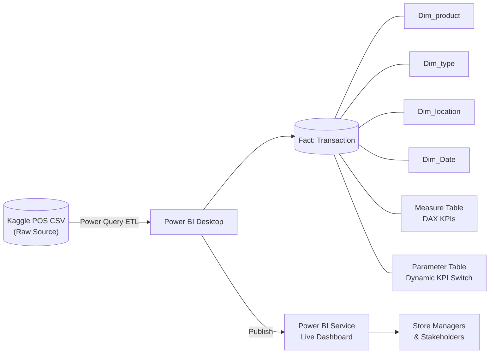

# ☕ Power BI Coffee Shop Sales Dashboard

> 📎 **Deliverables** &nbsp;|&nbsp; [📊 Live Dashboard](https://app.powerbi.com/view?r=eyJrIjoiNDg2NmI3MDYtOGQxYS00M2RmLTk2YWUtNTFmNTk4OGY0ODIxIiwidCI6IjMyNGViYTBiLTJjNTUtNDE3NS1iMzBjLThjODNlMzZmMTE2ZCJ9) &nbsp;|&nbsp; [📄 PDF Report](coffee_dashboard_3.pdf)

---

## 1. Quick Introduction

This project delivers an end-to-end Power BI sales dashboard for a three-location NYC coffee business, built on point-of-sale transaction data and designed for store managers and business stakeholders who need at-a-glance performance visibility. I owned the full pipeline — data modelling in a snowflake schema, DAX measure design with dynamic KPI switching, and UX-focused layout — turning raw café transactions into actionable intelligence. The most impressive outcome: all major KPIs climbed 22–23% in March, and the dashboard surfaces exactly which stores, products, and day-parts are driving that growth.

---

## 2. Problem Statement

Three geographically separate coffee shops — Astoria, Hell's Kitchen, and Lower Manhattan — were generating significant point-of-sale data with no unified view of performance. Managers lacked a reliable way to compare store revenue, understand which product categories drove sales, or identify whether weekday commuter traffic materially differed from weekend walk-ins. Without these answers, staffing decisions, promotional timing, and inventory planning were largely guesswork. This dashboard replaces that guesswork with a single, always-current source of truth: revenue, quantity sold, and transaction counts with period-over-period change indicators, broken down by store, product type, category, and day-of-week — so every decision is backed by data.

---

## 3. Architecture / Data Flow

The solution follows a snowflake schema centred on a Transaction fact table, surrounded by four dimension tables and enriched by two supporting analytical tables. Raw CSV data from the Kaggle point-of-sale dataset is loaded into Power Query for cleansing and transformation, then modelled in Power BI Desktop before being published to the Power BI Service for stakeholder consumption.

The Parameter Table enables dynamic metric selection — users toggle between Revenue, Quantity Sold, and Transaction Count without navigating away from the page. The Measure Table centralises all DAX logic, keeping report visuals clean and calculations maintainable.

---

## 4. Tech Stack

| Tool | Role | Why Chosen |
|------|------|------------|
| **Power BI Desktop** | Dashboard authoring & data modelling | Industry-standard BI tool; native DAX and Power Query integration |
| **Power Query (M)** | ETL — cleansing, shaping, loading | Built-in to Power BI; no external pipeline required for this dataset scale |
| **DAX** | KPI calculations, time-intelligence, dynamic metrics | Enables period-over-period comparisons and parameter-driven measures natively |
| **Snowflake Schema** | Relational data model | Reduces redundancy; separates product hierarchy from transaction grain |
| **Power BI Service** | Publishing & sharing | Free embed link for stakeholder access without licensing overhead |
| **Kaggle POS Dataset** | Source data | Realistic café transaction data covering multiple stores and product categories |

---

## 5. Key Features

- **Dynamic KPI switching** — a Parameter Table lets users flip between Revenue, Quantity Sold, and Transaction Count across all visuals simultaneously, eliminating the need for multiple report pages.
- **Period-over-period trend line** — interactive line and bar charts show weekly revenue and growth by store, with hover tooltips revealing daily revenue and exact % change vs. the prior period.
- **Store share indicators** — each store's contribution to total revenue is displayed alongside dynamic comparison bars, making relative performance instantly readable.
- **Product and category ranking** — top product types (Barista Espresso, Chai Tea, Gourmet Coffee) and categories (Coffee, Tea, Bakery) are ranked with horizontal bar charts, filterable by month and store.
- **Weekday vs. weekend traffic breakdown** — sales volume and customer counts are segmented by day type, giving managers evidence-based input for staffing rosters and promotional scheduling.

---

## 6. Getting Started

The fastest way to explore the dashboard is via the live embed link — no Power BI account required. Click the <strong>Live Dashboard</strong> link in the Deliverables block at the top of this page. Once open:

1. Use the **Month slicer** to navigate across the available date range.
2. Use the **Store slicer** to isolate Astoria, Hell's Kitchen, or Lower Manhattan — or compare all three simultaneously.
3. Use the **Metric selector** (Parameter Table) to switch the primary KPI between Revenue, Quantity Sold, and Transaction Count.
4. Hover over any bar or line data point to surface the tooltip with daily revenue and period-over-period % change.
5. Click a category or product bar to cross-filter all other visuals on the page.

To open the source file locally, download the <code>.pbix</code> file from this repository and open it in <strong>Power BI Desktop</strong> (free, Windows). The PDF report linked above is a static snapshot suitable for sharing without a Power BI account.

---

## 7. Results / Impact

March results confirmed strong, broad-based growth across all three locations. The dashboard surfaces these outcomes at a glance, with drill-down available to the daily level for any metric.

| Metric | Finding | Implication |
|--------|---------|-------------|
| **KPI Growth (March)** | All major KPIs up 22–23% vs. prior period | Business momentum is strong and consistent |
| **Top Revenue Category** | Coffee (led by espresso-based drinks) | Espresso menu is the primary margin driver |
| **Store Performance** | All 3 stores consistent; Lower Manhattan leads slightly | No underperforming location requiring urgent intervention |
| **Traffic Pattern** | Weekday traffic dominates revenue | Commuter and worker demand underpins the business model |
| **Daily Trend Quality** | Regular peaks, no concerning drops | Supply chain and operations are stable |

---

## 8. Lessons Learned

<strong>1. Parameter Tables unlock report scalability.</strong> Routing all three KPIs through a single Parameter Table rather than duplicating visuals reduced page count dramatically and kept the user experience focused. This pattern is now a default in my BI toolkit for any multi-metric report.

<strong>2. Snowflake schemas pay off in DAX simplicity.</strong> Separating Dim_type from Dim_product added one join but eliminated ambiguous many-to-many relationships that would have complicated time-intelligence calculations. The upfront modelling cost saved significant debugging time later.

<strong>3. Design language carries analytical credibility.</strong> Choosing a warm, coffee-inspired palette — espresso browns, latte beige, cream neutrals — was not purely aesthetic. Stakeholders responded more positively to a dashboard that felt aligned with the brand context, which smoothed the conversation toward the data insights rather than the tool itself.

---

## 9. Author

**Anh Huy Phung** — Analytics Engineer & Data Scientist

🌐 [Portfolio](https://huyphungportfolio.vercel.app/#) · 🐙 [GitHub](https://github.com/huypa) · 💼 [LinkedIn](https://www.linkedin.com/in/anh-huy-phung-a16503212/?skipRedirect=true) · 📧 [Huyphung.work@gmail.com](mailto:Huyphung.work@gmail.com)

