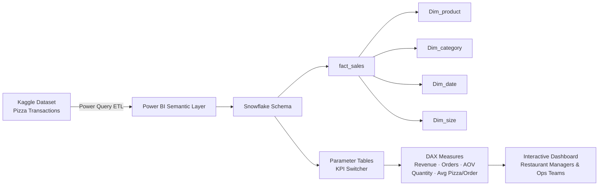

# Power BI Pizza Sales Analytics Dashboard

> 📎 **Deliverables** &nbsp;|&nbsp; [📊 Live Dashboard](https://app.powerbi.com/view?r=eyJrIjoiODkwNzMwOTQtMzVjYi00NjM0LWE0MGMtZWQ0NjE2NTIyZDliIiwidCI6IjMyNGViYTBiLTJjNTUtNDE3NS1iMzBjLThjODNlMzZmMTE2ZCJ9) &nbsp;|&nbsp; [📑 Presentation](https://docs.google.com/presentation/d/1BJHbNVPa5dgBUTS5R1_e-GQ4UisEIWd_HFxfMU5uvOY/edit?slide=id.g3a2318e546d_0_26#slide=id.g3a2318e546d_0_26) &nbsp;|&nbsp; [📄 PDF Report](Pizza_analysis.pdf)

---

## 1. Quick Introduction

This project delivers an end-to-end Power BI analytics solution for a <strong>pizza restaurant chain</strong>, transforming <strong>raw transaction data</strong> into <strong>actionable operational intelligence</strong>. Built for <strong>restaurant managers and operations teams</strong>, the dashboard surfaces <strong>revenue trends, product mix performance, and order efficiency metrics</strong> in a single, fully interactive view. The most impressive outcome: a <strong>percentile-based order interval analysis (P25–P90)</strong> built with <strong>DAX window functions</strong> that revealed <strong>75% of orders are completed within 16 minutes</strong> — a benchmark that directly informed <strong>staffing and throughput planning</strong>.

---

## 2. Problem Statement

- **Fragmented reporting**: Sales data was scattered across spreadsheets with no dynamic filtering or KPI switching.
- **Blind spots**: Managers couldn't answer basic questions like which category drives weekday revenue or how many orders miss the target completion window.
- **Decisions by gut**: Without consolidated visibility, menu changes, staffing schedules, and promotions were driven by intuition rather than data.
- **Solution**: A single-source dashboard that updates from source data and surfaces answers across all key performance dimensions instantly.

---

## 3. Architecture / Data Flow

The solution is built on a <strong>snowflake schema</strong> in Power BI, with <code>fact_sales</code> as the central fact table connected to <strong>four dimension tables</strong>. <strong>Parameter tables</strong> enable <strong>dynamic KPI switching</strong> without duplicating measures. The data originates from a Kaggle pizza transaction dataset, loaded and transformed via <strong>Power Query</strong> before being modelled in the <strong>semantic layer</strong>.

The <strong>data model screenshot</strong> below shows the full relationship map including the <strong>parameter tables</strong> used for dynamic metric switching.

---

## 4. Tech Stack

| Tool | Role | Why Chosen |
|------|------|------------|
| Power BI Desktop | Dashboard development & data modelling | Industry-standard BI tool with native DAX support |
| Power Query (M) | Data ingestion, cleaning, and transformation | Built-in ETL inside Power BI, no extra tooling needed |
| DAX | KPI measures, window functions, parameter logic | Most expressive language for dynamic Power BI calculations |
| Snowflake Schema | Data model design | Reduces redundancy and enables clean dimension filtering |
| Kaggle Dataset | Source transaction data | Realistic, publicly available pizza sales records |

---

## 5. Key Features

- **Dynamic KPI Switcher** — DAX parameter logic lets users instantly toggle between Total Revenue, Total Orders, Quantity Sold, Average Order Value, and Avg Pizza per Order across all visuals simultaneously.
- **Top/Bottom N Product Rankings** — User-controlled ranking visuals for both products and ingredients, filterable by any selected KPI metric.
- **Percentile Order Interval Analysis** — P25, P50, P75, and P90 order completion time benchmarks calculated using DAX window functions, revealing that 75% of orders are completed within 16 minutes.
- **Ingredient-Level Revenue vs. Quantity Correlation** — Scatter charts with dynamic average reference lines expose which ingredients over- or under-index on revenue relative to volume.
- **Category and Size Performance Indicators** — Weighted average pizza price and contribution metrics broken down by category and size, pinpointing the Classic and Supreme categories as the top revenue drivers.

---

## 6. Getting Started

<strong>Option 1 — Live Dashboard (no installation required):</strong> Click the <a href="https://app.powerbi.com/view?r=eyJrIjoiODkwNzMwOTQtMzVjYi00NjM0LWE0MGMtZWQ0NjE2NTIyZDliIiwidCI6IjMyNGViYTBiLTJjNTUtNDE3NS1iMzBjLThjODNlMzZmMTE2ZCJ9"><strong>Live Dashboard</strong></a> link. The report is published publicly via <strong>Power BI Service</strong> and is fully interactive in any modern browser — no account required. Use the KPI slicer at the top to switch metrics, and the category/month slicers to filter the view.

<strong>Option 2 — Local file (Power BI Desktop required):</strong>

1. Clone or download this repository.
2. Open `Pizza_analysis.pbix` in **Power BI Desktop** (free download from Microsoft).
3. If prompted to refresh data, point the source connection to **`data_pizza.xlsx`** in the same directory.
4. Interact with slicers and visuals directly in the Desktop application.

<strong>Target audience:</strong> <strong>Restaurant managers and operations teams</strong>. <strong>Data freshness:</strong> <strong>Static snapshot</strong> from the Kaggle dataset; refresh the <strong>Power Query source</strong> to update with new transaction data.

---

## 7. Results / Impact

| Metric | Finding |
|--------|---------|
| Weekly Revenue | Consistent $15,000 – $17,000 |
| Top Category Contribution | Classic & Supreme = 53% of total revenue |
| Top Size by Volume | Large pizzas represent the majority of sales |
| Peak Revenue Windows | 80% of revenue during lunch (Mon–Fri) and weekend dinner |
| Order Completion Time (P75) | 75% of orders completed within 16 minutes |
| Predictive Model | Additional forecasting model built for future business planning |

---

## 8. Lessons Learned

- **DAX window functions over pre-aggregation**: Building the percentile order interval analysis in DAX keeps thresholds dynamic with every slicer selection — now a reusable template for any time-based distribution work.
- **Parameter tables for KPI switching**: A single disconnected slicer wired to a parameter table eliminates measure duplication and repaints the entire report in one click, with the only cost being slightly more complex measure logic.
- **Design consistency drives adoption**: A deliberate domain-tied palette (tomato red, mozzarella white, basil green) and performance-direction colour-coding on KPI cards measurably reduced the time managers spent interpreting results.

---

## 9. Author

Written by **Anh Huy Phung** — Analytics Engineer & Data Scientist

🌐 [Portfolio](https://huyphungportfolio.vercel.app/#) · 🐙 [GitHub](https://github.com/huypa) · 💼 [LinkedIn](https://www.linkedin.com/in/anh-huy-phung-a16503212/?skipRedirect=true) · 📧 [Huyphung.work@gmail.com](mailto:Huyphung.work@gmail.com)

