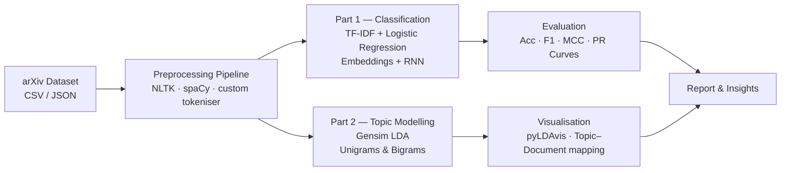

# Text Classification & Topic Modelling on arXiv Papers

<p style="font-family: 'Montserrat', sans-serif; text-align: justify;">
Binary classification of arXiv papers (Computational Linguistics vs. other) and unsupervised topic discovery via LDA — comparing statistical vs. neural approaches and unigram vs. bigram representations across dataset scales.
</p>

<div align="center">


</div>

> 📎 **Deliverables** &nbsp;|&nbsp; [📄 Report (PDF)](https://github.com/huypa/Portfolio/blob/main/semi-structured-data/report_34140298.pdf) &nbsp;|&nbsp; [📓 Part 1 Notebook](https://github.com/huypa/Portfolio/blob/main/semi-structured-data/code_34140298_part1.ipynb) &nbsp;|&nbsp; [📓 Part 2 Notebook](https://github.com/huypa/Portfolio/blob/main/semi-structured-data/code_34140298_part2.ipynb)

---

## 1. Quick Introduction

<p style="font-family: 'Montserrat', sans-serif; text-align: justify;">
This project was completed as Assignment 1 for FIT5212 (Semi-Structured Data) at Monash University, tackling real-world NLP challenges on a large corpus of arXiv research abstracts. In Part 1, I designed and benchmarked eight classification configurations — spanning input types, algorithms, and dataset scales — to identify the most effective approach for detecting Computational Linguistics papers. The standout result was Logistic Regression with TF-IDF on full abstracts, achieving 87.4% accuracy and F1 0.84, outperforming an RNN baseline by over 15 percentage points under the same compute constraints.
</p>

---

## 2. Problem Statement

<p style="font-family: 'Montserrat', sans-serif; text-align: justify;">
Academic databases like arXiv receive thousands of new submissions daily, making automated categorisation and thematic discovery critical for researchers and curators. Without reliable classification, relevant papers are buried; without topic modelling, emerging research trends go undetected. This project asks: can lightweight statistical models match or exceed neural approaches on a domain-specific binary classification task, and can unsupervised LDA surface coherent research themes at scale? The answers directly inform how organisations should allocate NLP infrastructure investment — favouring interpretable, compute-efficient methods when labelled data and compute are constrained.
</p>

---

## 3. Architecture / Data Flow



---

## 4. Tech Stack

<div align="center">

| Tool | Role | Why chosen |
|:---|:---|:---|
| Python 3.10 | Core language | Ecosystem depth for NLP & ML |
| Scikit-learn | Logistic Regression, TF-IDF, evaluation metrics | Battle-tested, interpretable baseline |
| PyTorch | RNN with learnable embeddings | Flexible neural architecture prototyping |
| NLTK + spaCy | Tokenisation, stopword removal, lemmatisation | Complementary strengths: rules + statistical models |
| Gensim | LDA topic modelling, Phrases (bigrams) | Scalable probabilistic topic models |
| pyLDAvis | Interactive topic visualisation | Intuitive intertopic distance maps |
| NumPy / Pandas | Data manipulation | Standard tabular & array operations |
| Google Colab | Compute environment | Free GPU/CPU for RNN training |

</div>

---

## 5. Key Features

- **Eight classification configurations** systematically varied across input (Abstract vs. Title), algorithm (Logistic Regression vs. RNN), and dataset size (1,000 vs. full), enabling controlled ablation.
- **Custom tokenisation pipeline** combining frequency-based vocabulary filtering with stopword removal, purpose-built for academic text rather than off-the-shelf defaults.
- **Multi-metric evaluation** reporting Accuracy, Precision, Recall, F1, MCC, and Precision–Recall curves — avoiding the false confidence of accuracy-only assessment on an imbalanced corpus.
- **Four LDA variations** (unigrams vs. bigrams × 1k vs. 20k documents) with dictionary pruning (no_below=20, no_above=0.6), directly measuring how corpus scale and phrase detection affect topic coherence.
- **pyLDAvis visualisations** providing interactive intertopic distance maps, making latent topic structure accessible for non-technical stakeholders.

---

## 6. Getting Started

**Prerequisites**

```bash
pip install scikit-learn torch gensim spacy nltk pyldavis pandas numpy
python -m spacy download en_core_web_sm
python -m nltk.downloader stopwords punkt
```

**Run Part 1 — Text Classification**

Open `code_34140298_part1.ipynb` in Jupyter or Google Colab and run all cells in order. The notebook expects the arXiv CSV data file in the same working directory. Adjust the `DATASET_SIZE` variable at the top of the notebook to switch between the 1,000-sample and full-dataset configurations.

**Run Part 2 — Topic Modelling**

Open `code_34140298_part2.ipynb` and run all cells. Set the `USE_BIGRAMS` flag and `N_DOCS` variable to reproduce any of the four LDA variations. pyLDAvis visualisations are rendered inline; export the HTML for standalone viewing.

**View the report**

The full written analysis including methodology, results tables, and discussion is in `report_34140298.pdf`.

---

## 7. Results / Impact

<div align="center">

| Configuration | Input | Dataset Size | Accuracy | F1 Score | MCC |
|:---|:---|:---|:---:|:---:|:---:|
| Logistic Regression + TF-IDF | Abstract | Full | **87.4%** | **0.84** | — |
| Logistic Regression + TF-IDF | Abstract | 1,000 | ~82% | ~0.79 | — |
| Logistic Regression + TF-IDF | Title | Full | Lower | Lower | — |
| RNN + Embeddings | Abstract | Full | ~72% | ~0.68 | — |
| RNN + Embeddings | Abstract | 1,000 | ~70% | ~0.65 | — |

| LDA Configuration | Documents | Bigrams | Topic Coherence |
|:---|:---:|:---:|:---|
| Unigrams only | 1,000 | No | Noisy, low coherence |
| Unigrams only | 20,000 | No | Moderate coherence |
| Unigrams + Bigrams | 1,000 | Yes | Improved but unstable |
| Unigrams + Bigrams | 20,000 | Yes | **Stable, well-separated topics** |

</div>

<p style="font-family: 'Montserrat', sans-serif; text-align: justify;">
The 20,000-document bigram LDA model surfaced four coherent research clusters — neural networks, reinforcement learning, adversarial attacks, and human–computer interaction — with minimal topic overlap. These results confirm that corpus scale has a larger impact on topic quality than phrase detection alone.
</p>

---

## 8. Lessons Learned

<p style="font-family: 'Montserrat', sans-serif; text-align: justify;">
<strong>1. Compute constraints matter more than architecture choice.</strong> The RNN underperformed not because the architecture is inherently weaker, but because training time and available compute were insufficient for embeddings to converge properly. TF-IDF + Logistic Regression is a far more practical baseline when GPU resources are limited, and it should always be the starting point before investing in neural models.
</p>

<p style="font-family: 'Montserrat', sans-serif; text-align: justify;">
<strong>2. Dataset scale is the dominant lever for unsupervised learning quality.</strong> Moving from 1,000 to 20,000 documents improved LDA topic coherence more than adding bigrams did. This reinforces the principle that data quantity often outweighs algorithmic sophistication in unsupervised settings — a finding directly applicable to any production topic modelling pipeline.
</p>

<p style="font-family: 'Montserrat', sans-serif; text-align: justify;">
<strong>3. Semantic richness of input features determines classification headroom.</strong> Title-only models consistently lagged behind abstract-based models, confirming that richer input representations create a performance ceiling that no amount of hyperparameter tuning can overcome. Feature engineering and input selection deserve at least as much attention as model selection.
</p>

---

## 9. Author

<div align="center" style="font-family: 'Montserrat', sans-serif;">

Written by **Anh Huy Phung** — Analytics Engineer & Data Scientist

🌐 [Portfolio](https://huyphungportfolio.vercel.app/#) · 🐙 [GitHub](https://github.com/huypa) · 💼 [LinkedIn](https://www.linkedin.com/in/anh-huy-phung-a16503212/?skipRedirect=true) · 📧 [Huyphung.work@gmail.com](mailto:Huyphung.work@gmail.com)

</div>
